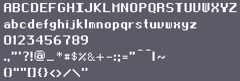
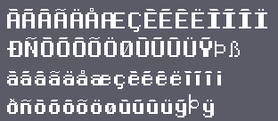

# Final-french font

I made a low res font using https://fontstruct.com/

Inspired by Final Fantasy fonts, adapted for French.

Download it here : https://fontstruct.com/fontstructions/show/1512023/final-french

It supports all of Basic Latin and most of Latin-1-supplement.

## Preview size 22

ABCDEFGHIJKLMNOPQRSTUVWXYZ 
abcdefghijklmnopqrstuvwxyz 
0123456789 
.,"'?!@_*#$%&+-:;="^`|~ 
()“”[]{}<>/\‘’ 

ÀÁÂÃÄÅÆÇÈÉÊËÌÍÎÏ 
ÐÑÒÓÔÕÖØÙÚÛÜÝÞß 
àáâãäåæçèéêëìíîï 
ðñòóôõöøùúûüýþÿ

